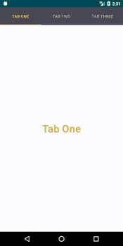

# TabLayout



Hello, 
I have focused on the implementation of **TabLayout**, in which you will also get to know 
how **ViewPager** & **FragmentPagerAdapter** plays an important role to provide more functionality to the TabLayouts.

# What I have learned. 
- [x] Extend **FragmentPagerAdapter** in a java class *TabPagerAdapter*.

- [x] Implementation of **design support library** in *build.gradle(Module:app)*.

- [x] Remove **ActionBar**, check *res->values->styles.xml*.

- [x] Making **Custom Style for TabLayout** using *Widget.Design.TabLayout*, check *res->values->Styles.xml*.

- [x] Proper use of text & colors in **strings.xml & colors.xml** file in a project, check *res->values*.

# Note to Novice
In TabPagerAdapter java class extend FragmentPagerAdapter and implement method:
* **getItem(int i)**
```javascript
    @Override
    public Fragment getItem(int i) {
        if(i==0){
            return new TabOne();
        }
        else if(i==1){
            return new TabTwo();
        }
        else
            return new TabThree();
    }
```
    
* **getCount()** 

```javascript
@Override
    public int getCount() {
        //Total number of tabs
        return 3;
    }
```

# Support :+1:  
[Instagram](https://www.instagram.com/amansharma.dev/)  
[Twitter](https://twitter.com/thekod25)

### Thank You! 
